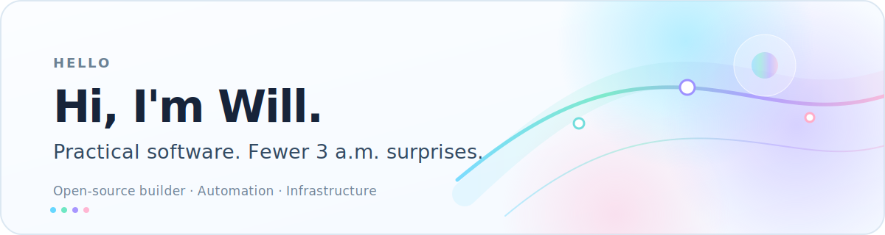

<picture>
  <source media="(prefers-color-scheme: dark)" srcset="./assets/hero-dark.svg">
  <source media="(prefers-color-scheme: light)" srcset="./assets/hero-light.svg">
  
</picture>

 

I build practical tools for automation, usage tracking, and the less glamorous parts of keeping systems running.

### Things I optimize for

- Clear interfaces — guessing is not an API.
- Automate repetitive work before it becomes folklore.
- Keep the clever parts small and the failure modes visible.

### Commit history, with a snake

Not every contribution gives in on the first pass.

<picture>
  <source media="(prefers-color-scheme: dark)" srcset="https://raw.githubusercontent.com/Willxup/Willxup/output/snake-dark.svg">
  <source media="(prefers-color-scheme: light)" srcset="https://raw.githubusercontent.com/Willxup/Willxup/output/snake.svg">
  
</picture>

### Usually within reach

`Go` · `C#` · `React` · `Shell` · `Docker` · `Linux` · `GitHub Actions`

Build useful things. Leave fewer mysteries behind.

